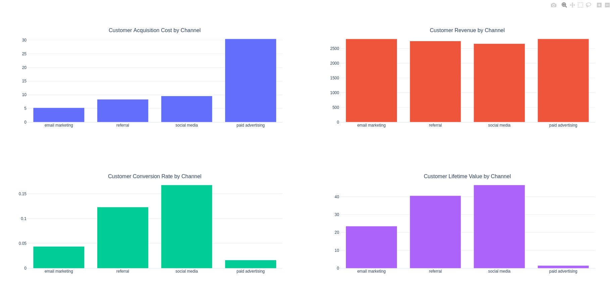

# SQL project 

Case study: https://statso.io/customer-lifetime-value-analytics-case-study/

Use sqlite and native SQL commands instead of SQLAlchemy or Django ORM to do an analytical study
of a customer database

python 3.12

```bash
pip install -r requirements.txt
python main.py
```

Inserts the data into an SQL database, then analyse it, grouping it by channel.
Produces a webpage with graphs


