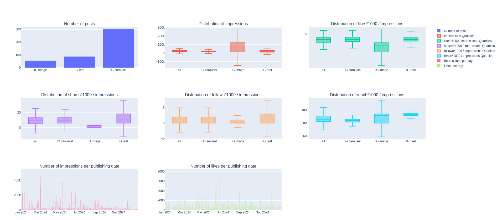

# EDA with SQL

https://statso.io/eda-using-sql-case-study/

You are a Data Analyst at a digital marketing firm tasked with optimizing Instagram content performance. Using a dataset of historical Instagram post metrics, perform an Exploratory Data Analysis (EDA) to uncover insights about engagement, post performance, and audience behavior.

Download the dataset into the `data` folder (`Instagram-Data-1.csv` file, abiut 250kB).

Use Python 3.12

```bash
pip install -r requirements.txt
python main.py
```

This script prints some information to the console (number of posts and null values) and creates a webpage with diagrams.

## Comments on the data

Null values: only in the `follows` and `plays columns`:

- follows: 5 /  446 posts
- plays: 314 / 446 posts
- data comments: 446 / 446 posts

We will not consider the `plays` or `data comments` category as there are too many unknown values.
The number of null follows is low, might ask why there are some, I would assume that a null value means 0 follows.

Most posts are of the carousel type, but the image posts get more impressions on average, with a way bigger variance than the other post types.
The reel posts get slightly more likes, shares, follows and reach overall.
There are a few posts that get a lot more visibility than the others: 57 outliers, so about 13%, get much more impressions than the rest of the posts. The rest of the
posts are quite close in terms of visibility (low variance).

Outliers:

- 57 outliers for the parameter impressions.
- 30 outliers for the parameter likes / impressions.
- 4 outliers for the parameter shares / impressions.
- 10 outliers for the parameter follows / impressions.
- 6 outliers for the parameter reach / impressions.

We observe some periodicity into the number of impressions and likes depending on the publishing date. It might be interesting to check if these match particular events and if publishing some days of the week may be a strategy to get more impressions and likes.


